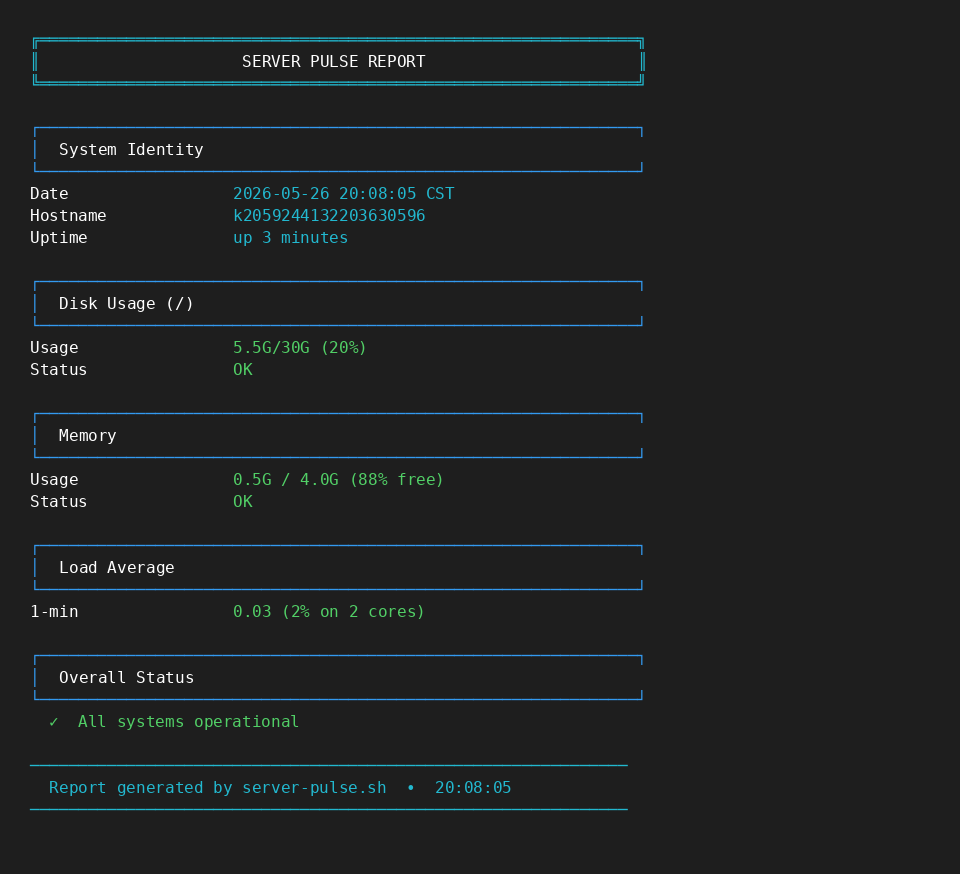

<div align="center">

# 🖥️ infra-server-pulse

**Lightweight Bash health monitor with color-coded warnings for disk, memory, and system load.**


</div>

---

## 📸 Demo



*Clean, boxed terminal report with instant health status.*

---

## 🎯 The Problem

Server health checks are often buried in complex monitoring stacks (Prometheus, Grafana, Nagios) that take hours to set up. For small agencies and single-server deployments, you need something that works **immediately** with zero dependencies — just Bash and a terminal.

This script gives you a production-ready health snapshot in under a second, with **visual alerts** that even non-technical team members can understand.

---

## ✅ The Solution

A single Bash script that prints a beautiful, framed report covering:

| Metric | Warning Threshold | Alert Color |
|--------|-------------------|-------------|
| **Disk Usage** (`/`) | > 90% | 🔴 Red |
| **Disk Usage** (`/`) | > 75% | 🟡 Yellow |
| **Memory Free** | < 10% | 🔴 Red |
| **Memory Free** | < 20% | 🟡 Yellow |
| **Load Average** | > 90% of cores | 🔴 Red |
| **Load Average** | > 70% of cores | 🟡 Yellow |

**Key features:**
- 🎨 **Color-coded ANSI output** — instant visual status recognition
- 📦 **Zero dependencies** — pure Bash, works on any Linux server
- 🧠 **Smart memory calculation** — uses `/proc/meminfo` (available memory, not just free)
- 📋 **Clean boxed layout** — professional terminal UI with headers and separators
- ⚡ **Sub-second execution** — no external API calls or heavy processes

---

## 🚀 Quick Start

```bash
# Clone the repo
git clone https://github.com/saraita90/infra-server-pulse.git
cd infra-server-pulse

# Make executable
chmod +x src/server-pulse.sh

# Run
./src/server-pulse.sh
```

Or run directly without cloning:
```bash
bash <(curl -s https://raw.githubusercontent.com/saraita90/infra-server-pulse/main/src/server-pulse.sh)
```

---

## 📁 Project Structure

```
infra-server-pulse/
├── README.md              # This file
├── src/
│   └── server-pulse.sh    # Main script
├── docs/
│   └── screenshot.png     # Terminal demo screenshot
└── .gitignore
```

---

## 🔧 Tech Stack

- **Bash 4+** — Scripting engine
- **ANSI Escape Codes** — Terminal colors and box-drawing characters
- **`/proc` filesystem** — Native Linux kernel interfaces for memory and load data
- **`df` / `uptime`** — Standard POSIX utilities

---

## 📚 What I Learned

- **ANSI color coding** — Implemented a reusable color system (`RED`, `GREEN`, `YELLOW`, `CYAN`, `BOLD`) for professional terminal UIs without external libraries like `tput` or `ncurses`.
- **`/proc/meminfo` parsing** — Learned that `MemAvailable` (Linux 3.14+) is the accurate metric for "usable memory," not `MemFree`. This prevents false panic alerts on systems with heavy cache usage.
- **Threshold logic** — Designed a cascading warning system (OK → Warning → Critical) that maps real-world sysadmin priorities to visual signals.
- **Box-drawing characters** — Used Unicode box-drawing (`╔═╗`, `┌─┐`, etc.) to create a dashboard feel without external tools.
- **`set -euo pipefail`** — Implemented Bash strict mode for production-grade error handling.

---

## 🗺️ Roadmap

- [ ] Add CPU temperature monitoring (`/sys/class/thermal`)
- [ ] JSON export mode for dashboard ingestion (`--json` flag)
- [ ] Docker container health check variant
- [ ] systemd timer integration for automated periodic reports
- [ ] Slack/Discord webhook alert on critical thresholds

---

## 🤝 Contributing

This is a portfolio project built as part of my DevOps learning journey. Suggestions and improvements are welcome via Issues or PRs.

---

<div align="center">

**Built with** ☕ **and** 🐧 **Linux**

[⬆ Back to Portfolio](https://github.com/YOUR_USERNAME)

</div>
